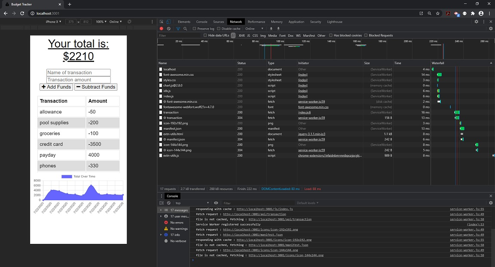
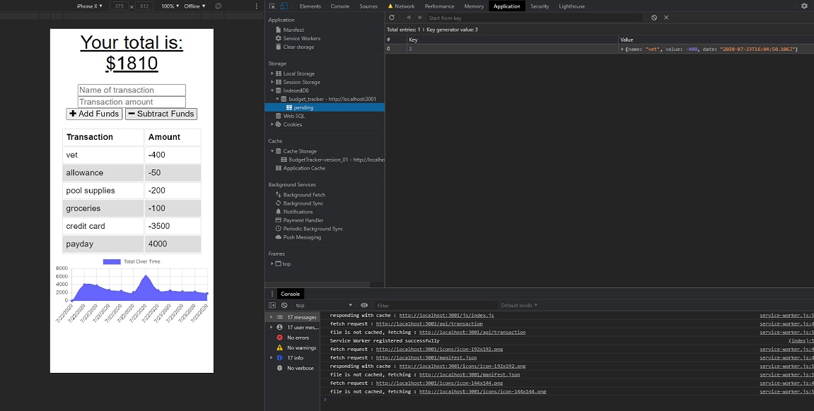

# Budget Tracker

  

## Table of Contents
* [Description](#description)
* [Installation](#installation)
* [Usage](#usage)
* [License](#license)
* [Contributions](#contributions)
* [Tests](#tests)
* [Contact Me](#contact-me)

## Description
Budget Tracker is a progressive web application that can be used to track monetary transactions throughout the month.  Whether they are connected to the internet or not, Budget Tracker will allow you to input expenses and deposits, and once the application is opened with an internet connection, will upload this information to the site without the user having to do anything else.

### Budget-Tracker Online

### Budget-Tracker Offline

## Installation
* Clone the Budget Tracker repository to a local drive that has npm and MongoDB installed using Bash. 
* Navigate to the newly-created budget-tracker folder and type 'npm install' to install the dependencies. 
* Type in 'npm start' to start the web server. 
* Open your browser and navigate to 'http://localhost:3001'

## Usage
All you have to do is fill in a description for the transaction, such as deposit, credit card, electric, etc, in the 'Name of transaction box.'  Then type in the transaction amount.  Finally, if the transaction is a deposit, press 'Add funds' and if the transaction is an expense press the 'Subtract funds.'  Your entry will appear in the table and a historical accounting of your transactions will display on the graph.

## License
MIT License

Copyright (c) [year] [fullname]

Permission is hereby granted, free of charge, to any person obtaining a copy
of this software and associated documentation files (the "Software"), to deal
in the Software without restriction, including without limitation the rights
to use, copy, modify, merge, publish, distribute, sublicense, and/or sell
copies of the Software, and to permit persons to whom the Software is
furnished to do so, subject to the following conditions:

The above copyright notice and this permission notice shall be included in all
copies or substantial portions of the Software.

THE SOFTWARE IS PROVIDED "AS IS", WITHOUT WARRANTY OF ANY KIND, EXPRESS OR
IMPLIED, INCLUDING BUT NOT LIMITED TO THE WARRANTIES OF MERCHANTABILITY,
FITNESS FOR A PARTICULAR PURPOSE AND NONINFRINGEMENT. IN NO EVENT SHALL THE
AUTHORS OR COPYRIGHT HOLDERS BE LIABLE FOR ANY CLAIM, DAMAGES OR OTHER
LIABILITY, WHETHER IN AN ACTION OF CONTRACT, TORT OR OTHERWISE, ARISING FROM,
OUT OF OR IN CONNECTION WITH THE SOFTWARE OR THE USE OR OTHER DEALINGS IN THE
SOFTWARE.

## Contributions
I am not currently looking for contributors

## Tests
* Open the page in your local browser, then open your browser's Developer Tools.
* Create and entry for the page in your local browser and submit, checking console to see if there are errors.
* Change the network status from Online to Offline.
* Create another entry and make sure that submitted data shows up on the table and graph, while checking console for errors.
* Change the network status from Offline to Online to get a message that the data was uploaded.

## Contact Me
* [Email](mailto:feuerbacherb@gmail.com)

* [GitHub](https://www.github.com/feuerbacherb)
